# DrawUFPB.io 🎨

Um bot de Telegram para criação e desenho de imagens utilizando um braço robótico, baseado na biblioteca [https://github.com/lucasddoliveira/AmericoDraws](AmericoDraws).

## 🇧🇷 Português

### 📋 Sobre o Projeto

DrawUFPB.io é uma aplicação que combina IA para geração de imagens com automação robótica para desenho. Através de uma interface amigável no Telegram, os usuários podem gerar imagens a partir de descrições textuais ou enviar suas próprias fotos, que serão processadas e desenhadas por um braço robótico.


<p float="left">
  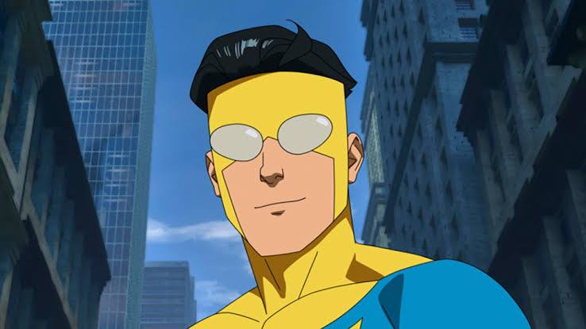
  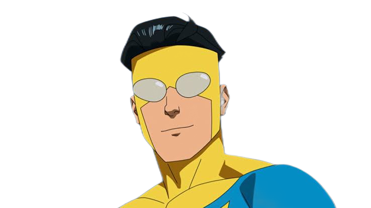
  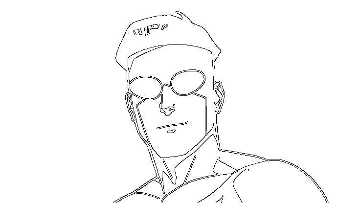
</p>

<p float="left">
  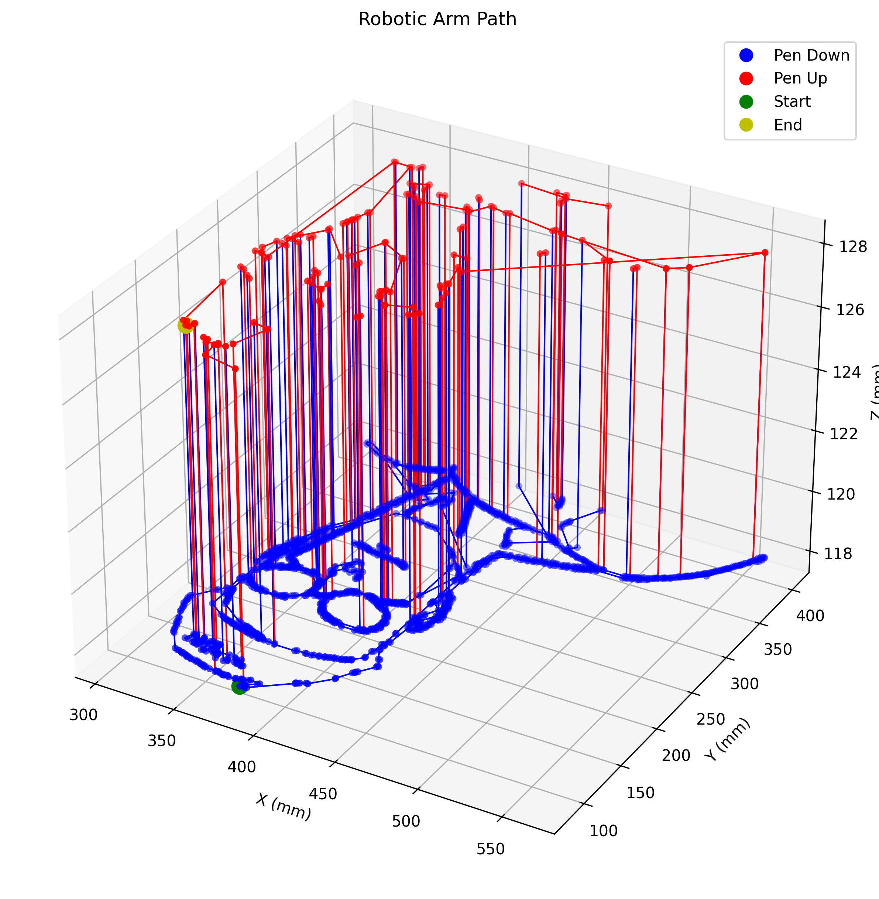
  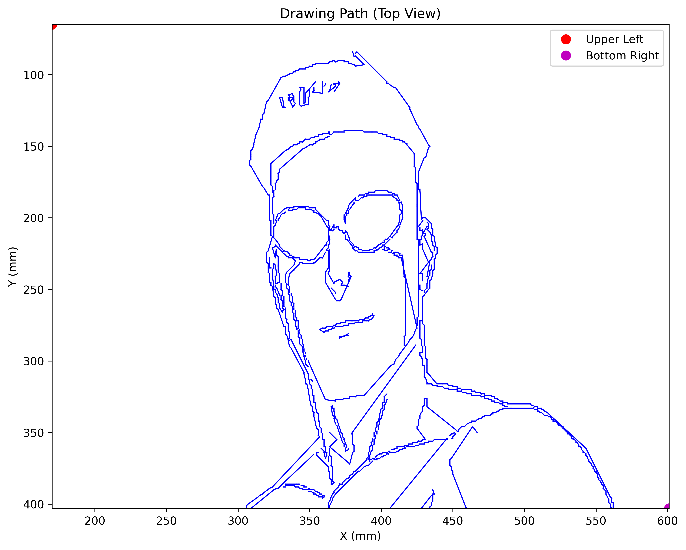 
  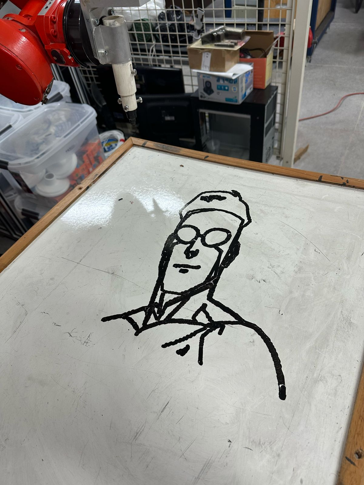 
</p>


<p float="left">
  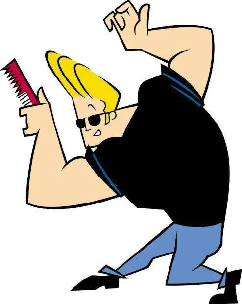
  
  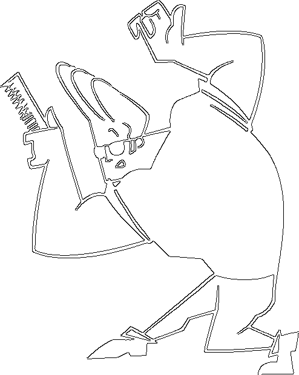
</p>

<p float="left">
  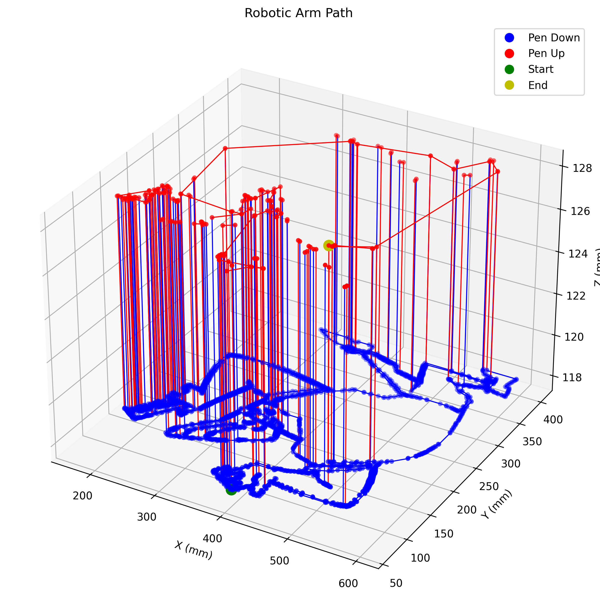
  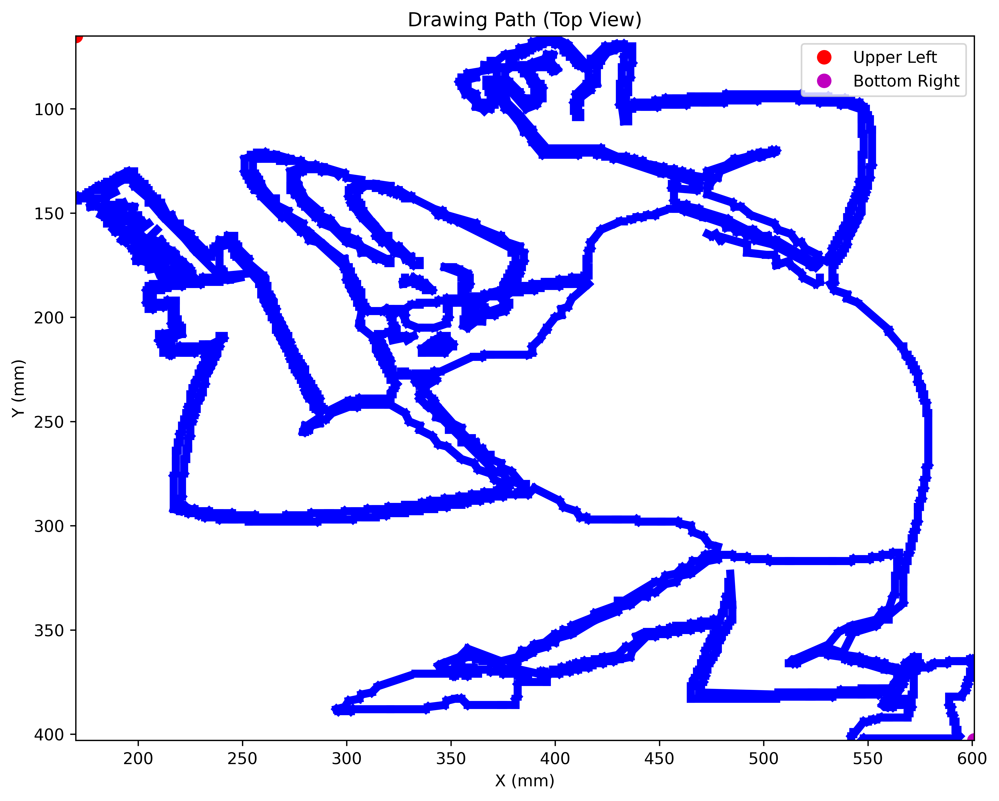 
  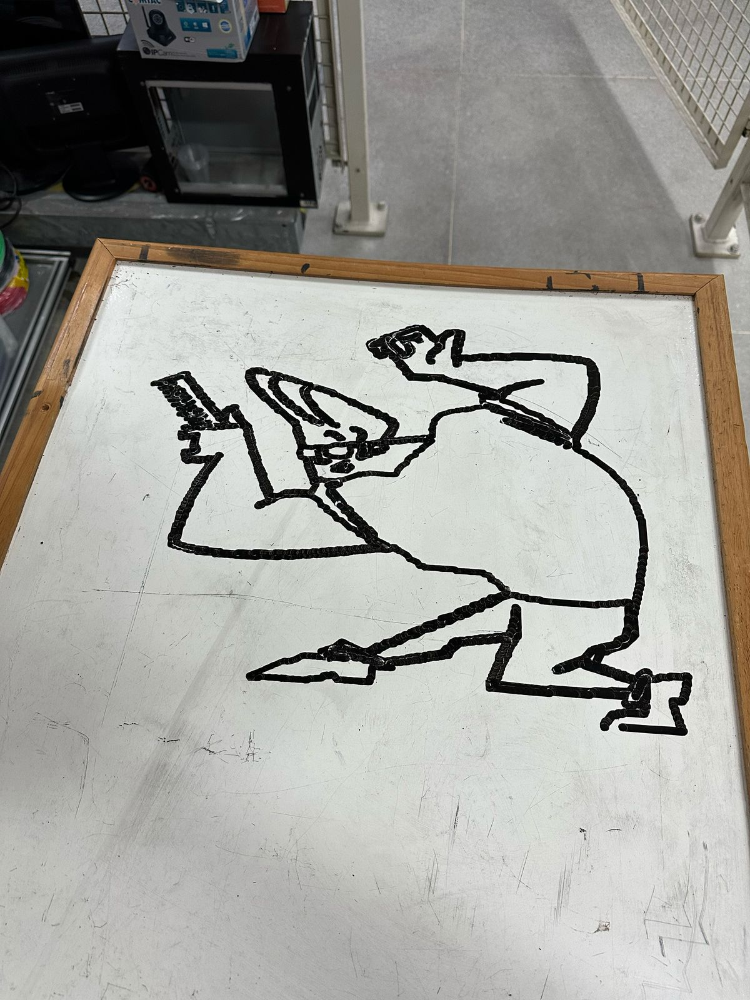 
</p>


### ✨ Características

- 🤖 Chat baseado em IA usando o modelo LLaMA 3.1 (via Groq)
- 🎨 Geração de imagens a partir de descrições textuais (usando FLUX.1-dev da HuggingFace)
- 📷 Processamento de fotos enviadas pelo usuário
- ✏️ Conversão automática de imagens em traços desenhável
- 🦾 Integração com braço robótico para desenho físico
- ⚙️ Personalização de parâmetros de desenho

### 🛠️ Tecnologias Utilizadas

- Python 3.x
- Telegram Bot API
- Groq API (LLaMA 3.1)
- HuggingFace FLUX.1-dev
- OpenCV
- Socket Communication
- PLC Bridge para controle do braço robótico

### 🚀 Como Instalar

1. Clone o repositório:
```bash
git clone https://github.com/seu-usuario/DrawUFPB.io.git
cd DrawUFPB.io
```

2. Instale as dependências:
```bash
pip install -r requirements.txt
```

3. Configure as variáveis de ambiente criando um arquivo `.env` na raiz do projeto:
```
TOKEN_TELEGRAM=seu_token_do_telegram
GROQ_API_KEY=sua_chave_api_groq
HUGGINGFACE_API_KEY=sua_chave_api_huggingface
CLP_IP=ip_do_seu_clp
```

### 🎮 Como Usar

1. Inicie o bot:
```bash
python chatbotAI.py
```

2. Abra o Telegram e procure pelo seu bot pelo nome de usuário (@seu_bot)

3. Inicie uma conversa com o comando `/start`

4. Comandos disponíveis:
   - `/start` - Inicia/reinicia a conversa
   - `/image` - Gera uma imagem a partir de uma descrição
   - `/upload` - Envia sua própria foto para desenho
   - `/params` - Visualiza e edita parâmetros de desenho
   - `/help` - Exibe a mensagem de ajuda
   - `/clear` - Limpa o histórico de conversa
   - `/cancel` - Cancela a operação atual

### ⚙️ Parâmetros de Desenho

O bot permite a personalização de vários parâmetros que afetam como as imagens são processadas e desenhadas:

- `process_cell_size`: Resolução do processamento de imagem (menor = mais detalhes)
- `points_cell_width`: Largura de cada célula em pontos
- `z_up`: Altura que a caneta se move entre traços
- `remove_background`: Remove o fundo da imagem (1=sim, 0=não)
- `bg_threshold`: Limiar para remoção de fundo
- `bg_erode_pixels`: Força da erosão do fundo
- `threshold1`: Limiar inferior para detecção de bordas
- `threshold2`: Limiar superior para detecção de bordas
- `blur_size`: Tamanho do desfoque para detecção de bordas
- `distance_threshold`: Distância mínima entre pontos
- `epsilon`: Fator de simplificação para linhas
- `linewidth`: Largura das linhas desenhadas

### 👥 Autores

- Lucas Dantas
- Gustavo Henrique
- Matheus Navarro

---

## 🇬🇧 English

### 📋 About the Project

DrawUFPB.io is an application that combines AI image generation with robotic automation for drawing. Through a friendly Telegram interface, users can generate images from text descriptions or upload their own photos, which will be processed and drawn by a robotic arm.

<p float="left">
  
  
  
</p>

<p float="left">
  
   
   
</p>


<p float="left">
  
  
  
</p>

<p float="left">
  
   
   
</p>

### ✨ Features

- 🤖 AI-based chat using LLaMA 3.1 model (via Groq)
- 🎨 Image generation from text descriptions (using HuggingFace's FLUX.1-dev)
- 📷 Processing of user-uploaded photos
- ✏️ Automatic conversion of images to drawable strokes
- 🦾 Integration with robotic arm for physical drawing
- ⚙️ Customization of drawing parameters

### 🛠️ Technologies Used

- Python 3.x
- Telegram Bot API
- Groq API (LLaMA 3.1)
- HuggingFace FLUX.1-dev
- OpenCV
- Socket Communication
- PLC Bridge for robotic arm control

### 🚀 How to Install

1. Clone the repository:
```bash
git clone https://github.com/your-username/DrawUFPB.io.git
cd DrawUFPB.io
```

2. Install dependencies:
```bash
pip install -r requirements.txt
```

3. Configure environment variables by creating a `.env` file in the project root:
```
TOKEN_TELEGRAM=your_telegram_token
GROQ_API_KEY=your_groq_api_key
HUGGINGFACE_API_KEY=your_huggingface_api_key
CLP_IP=your_plc_ip
```

### 🎮 How to Use

1. Start the bot:
```bash
python chatbotAI.py
```

2. Open Telegram and search for your bot by username (@your_bot)

3. Start a conversation with the `/start` command

4. Available commands:
   - `/start` - Start/restart the conversation
   - `/image` - Generate an image from a description
   - `/upload` - Send your own photo for drawing
   - `/params` - View and edit drawing parameters
   - `/help` - Display help message
   - `/clear` - Clear conversation history
   - `/cancel` - Cancel current operation

### ⚙️ Drawing Parameters

The bot allows customization of various parameters that affect how images are processed and drawn:

- `process_cell_size`: Image processing resolution (lower = more detail)
- `points_cell_width`: Width of each cell in points
- `z_up`: Height the pen moves up between strokes
- `remove_background`: Remove image background (1=yes, 0=no)
- `bg_threshold`: Background removal threshold
- `bg_erode_pixels`: Background erosion strength
- `threshold1`: Edge detection lower threshold
- `threshold2`: Edge detection upper threshold
- `blur_size`: Blur size for edge detection
- `distance_threshold`: Minimum distance between points
- `epsilon`: Simplification factor for lines
- `linewidth`: Width of drawn lines

### 👥 Authors

- Lucas Dantas
- Gustavo Henrique
- Matheus Navarro

---

## 📝 License

This project is licensed under the MIT License - see the LICENSE file for details.

## 🤝 Contributing

Contributions, issues, and feature requests are welcome!