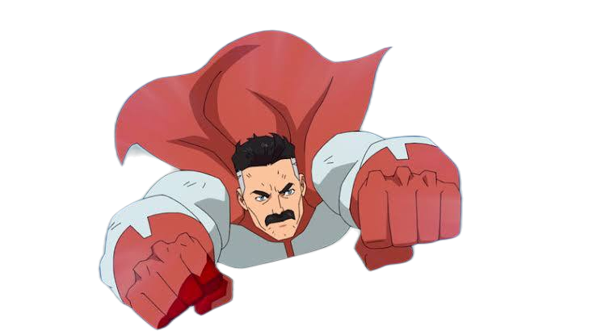
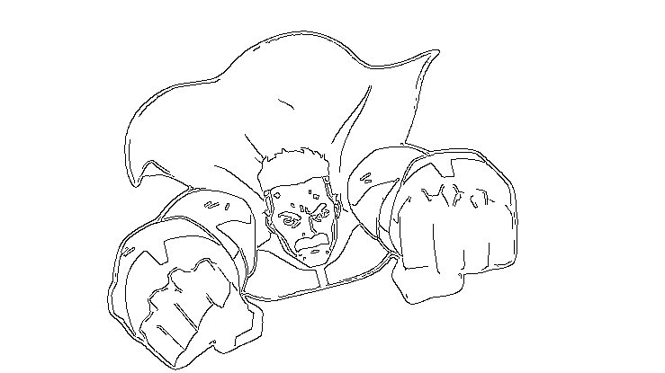
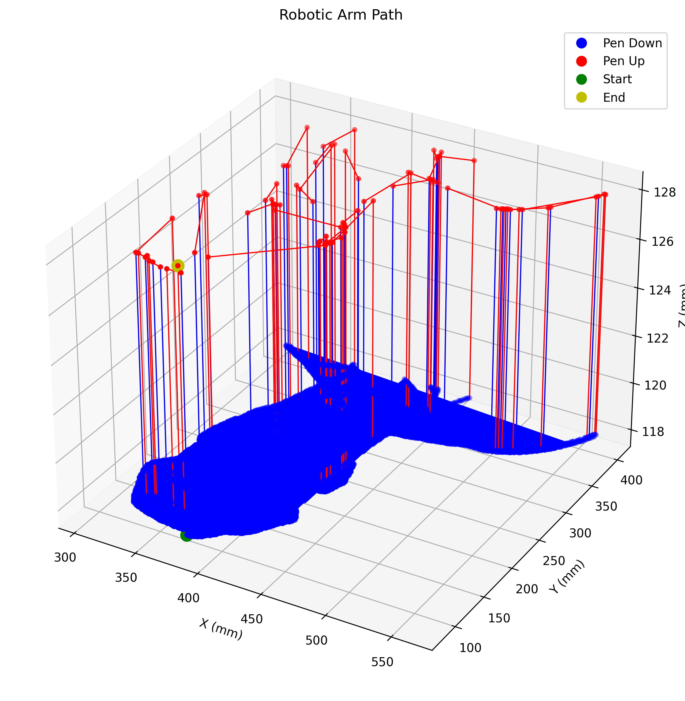
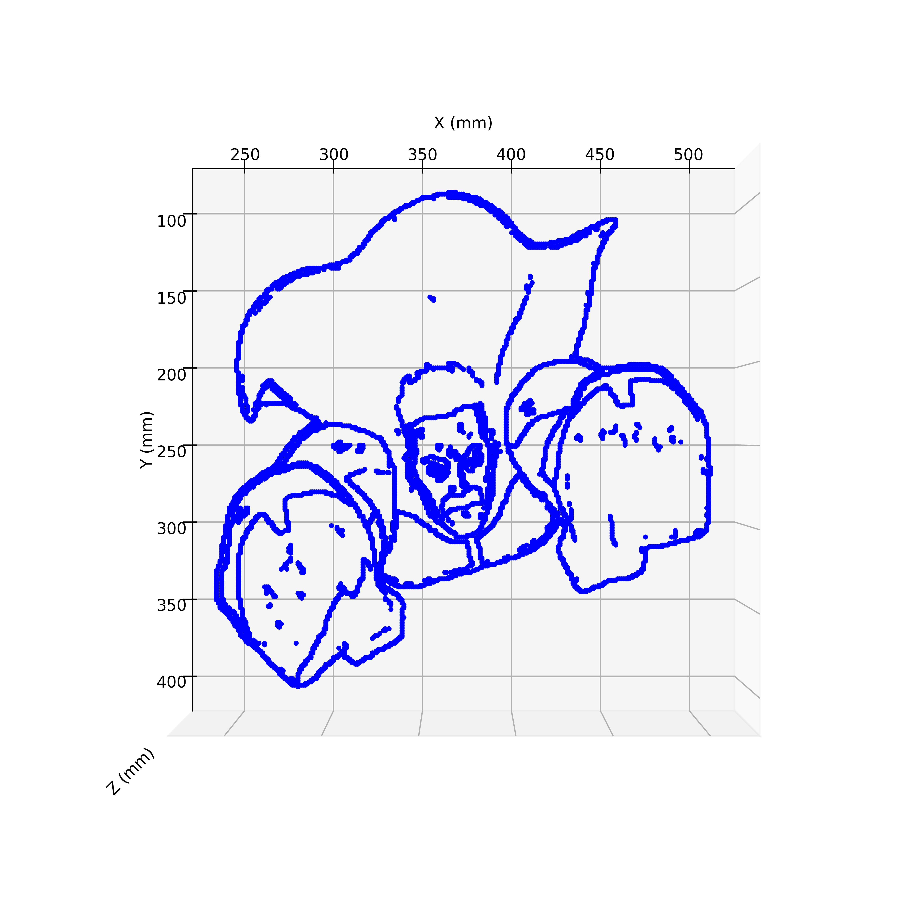

# DrawUFPB.io 🎨 (pt-BR)

## Sobre o Projeto 📖

DrawUFPB.io é um sistema integrado que combina inteligência artificial, processamento de imagens e robótica para criar desenhos físicos usando um braço robótico. O projeto foi desenvolvido na **Universidade Federal da Paraíba (UFPB)**, para aplicações de automação e robótica, na disciplina de Sistemas de Automação Industrial (2024.2).

<p float="left">
  
  
  
</p>

<p float="left">
  
   
</p>

## Autores 👥

- Lucas Dantas
- Gustavo Henrique
- Matheus Navarro

## Funcionalidades 🔍

- 💬 Chatbot com IA para interação com usuários
- 🖼️ Geração de imagens a partir de descrições textuais usando IA
- 📸 Processamento de fotos enviadas pelos usuários
- 🤖 Execução de desenhos usando um braço robótico
- 🔄 Interface via Telegram para fácil acesso e usabilidade

## Arquitetura do Sistema 🏗️

O projeto é composto por três módulos principais:

1. **chatbotAI.py**: Interface do usuário via Telegram, gerenciamento de comandos e integração com modelos de IA
2. **image_processor.py**: Algoritmos de processamento de imagem para converter imagens em coordenadas de desenho
3. **plcBridge.py**: Comunicação com o CLP (Controlador Lógico Programável) para controlar o braço robótico

## Requisitos 📋

- Python 3.8+
- Bibliotecas:
  - python-telegram-bot
  - groq
  - rembg
  - numpy
  - opencv-cv2
  - matplotlib
  - PIL
  - huggingface_hub
  - requests
  - python-dotenv

## Configuração ⚙️

1. Clone o repositório:
```bash
git clone https://github.com/lucasddoliveira/DrawUFPB.io.git
cd drawufpb.io
```

2. Instale as dependências:
```bash
pip install -r requirements.txt
```

3. Crie e configure o arquivo `.env` com as seguintes variáveis:
```
TOKEN_TELEGRAM=seu_token_do_telegram
GROQ_API_KEY=sua_chave_api_groq
HUGGINGFACE_API_KEY=sua_chave_api_huggingface
CLP_IP=endereco_ip_do_clp
```

## Como Usar 🚀

1. Inicie o bot do Telegram:
```bash
python chatbotAI.py
```

2. Interaja com o bot usando os seguintes comandos:
   - `/start` - Inicia ou reinicia a conversa
   - `/image` - Gera uma imagem a partir de uma descrição
   - `/upload` - Carrega sua própria foto para desenho
   - `/help` - Mostra a mensagem de ajuda
   - `/clear` - Limpa o histórico de conversa
   - `/cancel` - Cancela a operação atual

## Fluxo de Funcionamento 🔄

1. O usuário interage com o bot via Telegram
2. Para gerar imagens:
   - O usuário envia o comando `/image` seguido de uma descrição
   - A IA gera uma imagem usando o modelo FLUX.1-dev da Hugging Face
   - A imagem é processada para detectar contornos
   - O sistema converte os contornos em coordenadas para o braço robótico
   - O usuário confirma se deseja desenhar a imagem fisicamente

3. Para processar fotos:
   - O usuário envia o comando `/upload` e carrega uma foto
   - O sistema processa a foto, remove o fundo e detecta contornos
   - O sistema converte os contornos em coordenadas para o braço robótico
   - O usuário confirma se deseja desenhar a imagem fisicamente

## Detalhes Técnicos 🔧

### Processamento de Imagem

O módulo `image_processor.py` realiza várias etapas para transformar uma imagem em coordenadas de desenho:

1. Remoção de fundo usando IA (rembg)
2. Detecção de contornos usando algoritmos de visão computacional (OpenCV)
3. Conversão de contornos em uma matriz de pontos
4. Geração de sequências de pontos otimizadas para o movimento do braço robótico
5. Visualização 3D para preview do resultado

### Comunicação com o CLP

O módulo `plcBridge.py` gerencia a comunicação com o Controlador Lógico Programável através de socket TCP/IP:

1. Estabelece conexão com o CLP usando o IP configurado
2. Envia comandos para mover o braço robótico para posições específicas
3. Recebe feedback sobre a posição atual do braço
4. Gerencia a sequência de movimentos para executar o desenho

## 📌 Observações

- Os limites de desenho são definidos pelas bordas `[170, 65, -119]` e `[601, 403, -119]`.
- O braço levanta entre sequências para evitar colisões.
- O braço robótico utilizado neste projeto é da marca Comau.
- O CLP (Controlador Lógico Programável) empregado é da Siemens.
- Este repositório contém apenas o servidor remoto da aplicação. Para que o sistema funcione completamente, é necessário também hospedar os arquivos responsáveis pela leitura e escrita das posições no controlador do braço robótico.
- Em caso de dúvidas, entre em contato pelo e-mail: lucasddoliveira1@gmail.com

## Licença 📜

Este projeto está licenciado sob a licença MIT. Veja o arquivo `LICENSE` para mais detalhes.

---

# DrawUFPB.io 🎨 (en-US)

## About the Project 📖

DrawUFPB.io is an integrated system that combines artificial intelligence, image processing, and robotics to create physical drawings using a robotic arm. The project was developed at the **Federal University of Paraíba (UFPB)** for automation and robotics applications, as part of the Industrial Automation Systems course (2024.2).

<p float="left">
  
  
  
</p>

<p float="left">
  
   
</p>


## Authors 👥

- Lucas Dantas
- Gustavo Henrique
- Matheus Navarro

## Features 🔍

- 💬 AI chatbot for user interaction
- 🖼️ AI image generation from text descriptions
- 📸 Processing of user-uploaded photos
- 🤖 Drawing execution using a robotic arm
- 🔄 Telegram interface for easy access and usability

## System Architecture 🏗️

The project consists of three main modules:

1. **chatbotAI.py**: User interface via Telegram, command management, and AI model integration
2. **image_processor.py**: Image processing algorithms to convert images into drawing coordinates
3. **plcBridge.py**: Communication with the PLC (Programmable Logic Controller) to control the robotic arm

## Requirements 📋

- Python 3.8+
- Libraries:
  - python-telegram-bot
  - groq
  - rembg
  - numpy
  - opencv-cv2
  - matplotlib
  - PIL
  - huggingface_hub
  - requests
  - python-dotenv

## Setup ⚙️

1. Clone the repository:
```bash
git clone https://github.com/lucasddoliveira/DrawUFPB.io.git
cd drawufpb.io
```

2. Install dependencies:
```bash
pip install -r requirements.txt
```

3. Create and configure the `.env` file with the following variables:
```
TOKEN_TELEGRAM=your_telegram_token
GROQ_API_KEY=your_groq_api_key
HUGGINGFACE_API_KEY=your_huggingface_api_key
CLP_IP=plc_ip_address
```

## How to Use 🚀

1. Start the Telegram bot:
```bash
python chatbotAI.py
```

2. Interact with the bot using the following commands:
   - `/start` - Start or restart the conversation
   - `/image` - Generate an image from a description
   - `/upload` - Upload your own photo for drawing
   - `/help` - Show the help message
   - `/clear` - Clear the conversation history
   - `/cancel` - Cancel the current operation

## Operation Flow 🔄

1. The user interacts with the bot via Telegram
2. For image generation:
   - The user sends the `/image` command followed by a description
   - AI generates an image using Hugging Face's FLUX.1-dev model
   - The image is processed to detect contours
   - The system converts the contours into coordinates for the robotic arm
   - The user confirms whether they want to physically draw the image

3. For photo processing:
   - The user sends the `/upload` command and uploads a photo
   - The system processes the photo, removes the background, and detects contours
   - The system converts the contours into coordinates for the robotic arm
   - The user confirms whether they want to physically draw the image

## Technical Details 🔧

### Image Processing

The `image_processor.py` module performs several steps to transform an image into drawing coordinates:

1. Background removal using AI (rembg)
2. Contour detection using computer vision algorithms (OpenCV)
3. Conversion of contours into a point matrix
4. Generation of optimized point sequences for robotic arm movement
5. 3D visualization for result preview

### PLC Communication

The `plcBridge.py` module manages communication with the Programmable Logic Controller through TCP/IP socket:

1. Establishes connection with the PLC using the configured IP
2. Sends commands to move the robotic arm to specific positions
3. Receives feedback on the current position of the arm
4. Manages the sequence of movements to execute the drawing

## 📌 Notes

- Drawing area is defined between `[170, 65, -119]` and `[601, 403, -119]`.
- The robotic arm lifts between strokes to avoid dragging.
- The robotic arm used in this project is manufactured by Comau.
- The PLC (Programmable Logic Controller) used is from Siemens.
- This repository contains only the remote application server. For the system to function fully, it is also necessary to host the files responsible for reading and writing positions to the robotic arm controller.
- If you have any questions, please contact: lucasddoliveira1@gmail.com


## License 📜

This project is licensed under the MIT License. See the `LICENSE` file for details.
