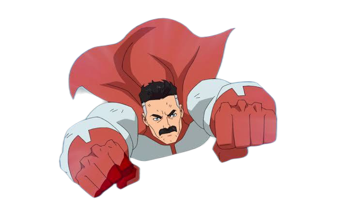
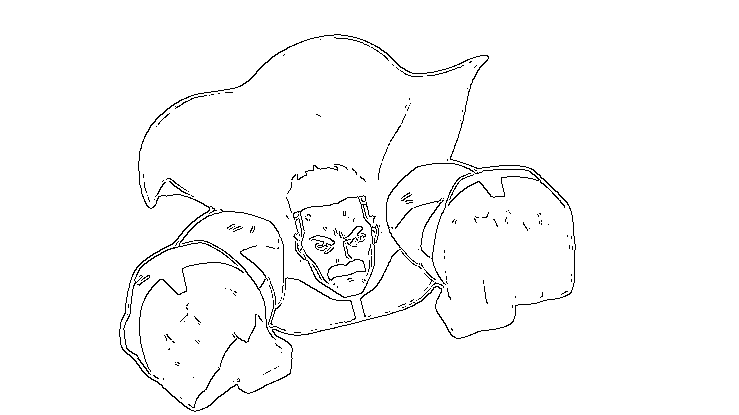
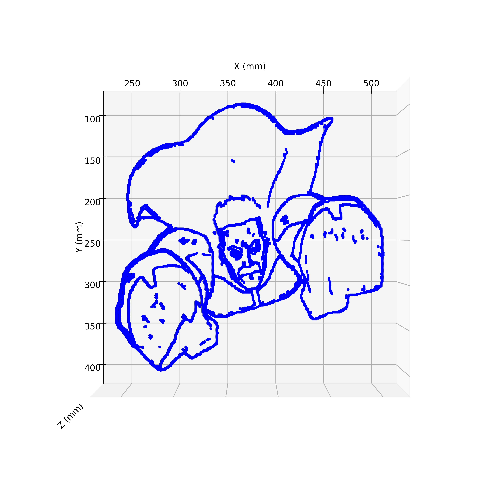

# 🇧🇷 README - DrawUFPB.io

### 🧠 Visão Geral

**DrawUFPB.io** é um projeto que conecta usuários via **Telegram Bot** a um sistema de **processamento de imagem** com controle de um **braço robótico**, utilizando um **PLC (Controlador Lógico Programável)**. A partir de uma imagem enviada, o sistema processa a imagem, remove o fundo, extrai os contornos e gera comandos para desenhá-la fisicamente com o braço robótico.

<p float="left">
  
  
  
</p>

<p float="left">
  
</p>

---

### 📁 Estrutura de Arquivos

```
DrawUFPB.io/
├── bot.py                # Bot do Telegram para receber imagens e interagir com o usuário
├── image_processor.py    # Processamento da imagem: remove fundo, detecta contornos, gera coordenadas
├── plcBridge.py          # Comunicação com o CLP para controlar o braço robótico
```

---

### 🤖 Funcionamento do Bot

1. O usuário inicia a conversa com `/start`.
2. O bot pergunta se o usuário quer desenhar algo.
3. Se o usuário responder "yes", o bot solicita uma imagem.
4. A imagem é processada:
   - Remove o fundo.
   - Detecta os contornos.
   - Gera um vetor de pontos (trajetória).
   - Envia uma imagem com visualização 3D como prévia.
5. O usuário confirma se deseja que o braço desenhe.
6. Se sim, os comandos são enviados ao CLP que move o braço robótico conforme os pontos gerados.

---

### 🧩 Componentes

#### `bot.py`
- Utiliza a biblioteca `python-telegram-bot`.
- Controla o fluxo de conversação e comandos.
- Interage com os módulos de processamento de imagem e o PLC.

#### `image_processor.py`
- Usa `rembg` para remover o fundo da imagem.
- Aplica detecção de bordas com Canny.
- Gera uma matriz binária e converte em coordenadas 3D.
- Cria uma visualização em 3D da trajetória com `matplotlib`.

#### `plcBridge.py`
- Usa `socket` para conectar ao PLC.
- Converte coordenadas em bytes e envia para o CLP.
- Lê posições em tempo real do braço.
- Move o braço para desenhar com precisão.

---

### ⚙️ Pré-requisitos

- Python 3.8+
- Instalar dependências:
  ```bash
  pip install python-telegram-bot rembg opencv-python numpy matplotlib pillow python-dotenv
  ```

---

### 🚀 Como executar

1. Altere o **token do Telegram** em `bot.py` pela sua chave:
   ```python
   application = Application.builder().token("TOKEN_TELEGRAM").build()
   ```

2. Altere o **IP do CLP** em `plcBridge.py` pela IP do seu CLP (ex: 150.165.164.834):
   ```python
   application = Application.builder().token("CLP_IP").build()
   ```

3. Execute o bot:
   ```bash
   python bot.py
   ```

4. No Telegram, inicie a conversa com o bot e envie uma imagem!


---

### 📌 Observações

- Os limites de desenho são definidos pelas bordas `[170, 65, -119]` e `[601, 403, -119]`.
- O braço levanta entre sequências para evitar colisões.
- O braço robótico utilizado neste projeto é da marca Comau.
- O CLP (Controlador Lógico Programável) empregado é da Siemens.
- Este repositório contém apenas o servidor remoto da aplicação. Para que o sistema funcione completamente, é necessário também hospedar os arquivos responsáveis pela leitura e escrita das posições no controlador do braço robótico.
- Em caso de dúvidas, entre em contato pelo e-mail: lucasddoliveira1@gmail.com
---

### 👨‍🔧 Equipe

Projeto desenvolvido na **Universidade Federal da Paraíba (UFPB)** para aplicações de automação e robótica, durante a disciplina de Sistemas de Automação Industrial (Semestre 2024.2). Autores: Lucas Dantas e Gustavo Henrique.

---

# 🇺🇸 README - DrawUFPB.io

### 🧠 Overview

**DrawUFPB.io** is a project that connects users via a **Telegram Bot** to a system that processes images and physically draws them using a **robotic arm controlled by a PLC (Programmable Logic Controller)**.


<p float="left">
  
  
  
</p>

<p float="left">
  
</p>

---

### 📁 Project Structure

```
DrawUFPB.io/
├── bot.py                # Telegram bot to receive images and interact with users
├── image_processor.py    # Image processing: background removal, edge detection, coordinate generation
├── plcBridge.py          # Communication with the PLC to control the robotic arm
```

---

### 🤖 Bot Flow

1. User starts with `/start`.
2. Bot asks: "Do you want to draw something?"
3. If the user says "yes", the bot asks for an image.
4. The image is processed:
   - Background is removed.
   - Contours are detected.
   - A point sequence is generated (drawing path).
   - A 3D preview is returned.
5. User confirms if the result should be drawn.
6. If confirmed, the PLC receives instructions and the robot arm executes the drawing.

---

### 🧩 Components

#### `bot.py`
- Uses `python-telegram-bot` to handle user interaction.
- Coordinates image processing and robot execution.

#### `image_processor.py`
- Uses `rembg` for background removal.
- Applies Canny edge detection.
- Generates 3D coordinates and 3D path preview using `matplotlib`.

#### `plcBridge.py`
- Uses `socket` to communicate with a PLC.
- Sends encoded drawing coordinates.
- Reads real-time arm position.
- Commands the arm to draw point by point.

---

### ⚙️ Requirements

- Python 3.8+
- Install dependencies:
  ```bash
  pip install python-telegram-bot rembg opencv-python numpy matplotlib pillow python-dotenv
  ```

---

### 🚀 How to Run

1. Replace the **Telegram token** in `bot.py` with your own key:
   ```python
   application = Application.builder().token("TELEGRAM_TOKEN").build()
   ```

2. Replace the **PLC IP address** in `plcBridge.py` with the IP of your PLC (e.g., 150.165.164.834):
   ```python
   application = Application.builder().token("CLP_IP").build()
   ```

3. Start the bot:
   ```bash
   python bot.py
   ```

4. Open Telegram and send a message to your bot!

---

### 📌 Notes

- Drawing area is defined between `[170, 65, -119]` and `[601, 403, -119]`.
- The robotic arm lifts between strokes to avoid dragging.
- The robotic arm used in this project is manufactured by Comau.
- The PLC (Programmable Logic Controller) used is from Siemens.
- This repository contains only the remote application server. For the system to function fully, it is also necessary to host the files responsible for reading and writing positions to the robotic arm controller.
- If you have any questions, please contact: lucasddoliveira1@gmail.com

---

### 👨‍🔧 Team

Project developed at **Federal University of Paraíba (UFPB)** for automation and robotics applications, as part of the Industrial Automation Systems course (Semester 2024.2). Authors: Lucas Dantas and Gustavo Henrique.
